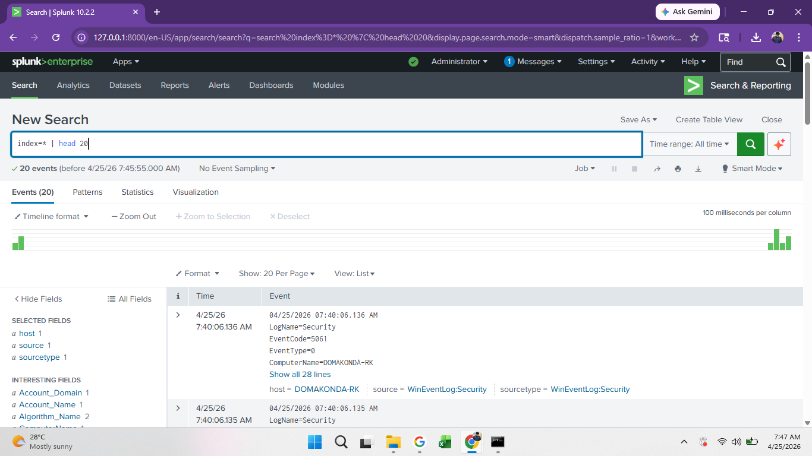
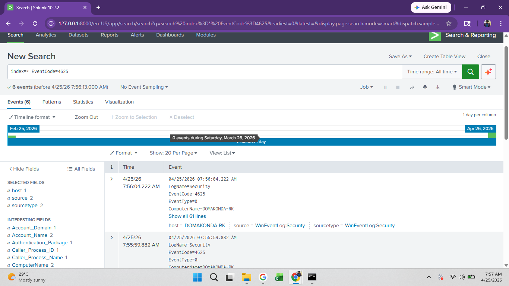
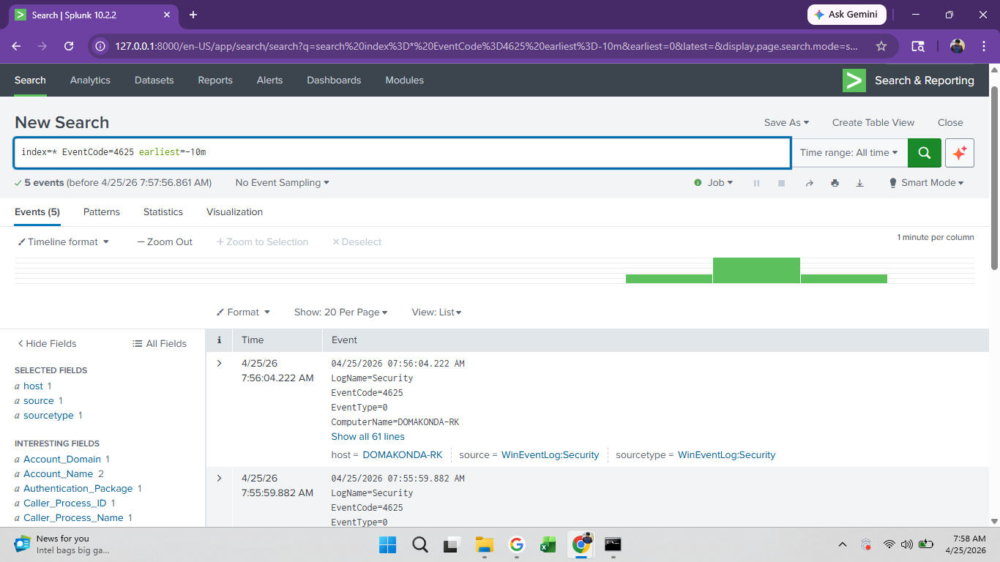
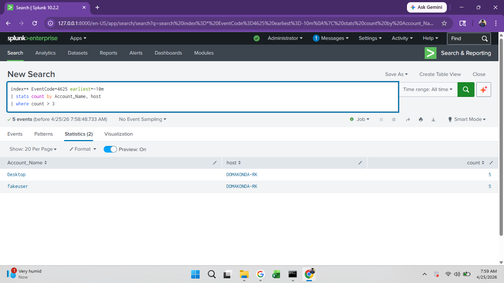
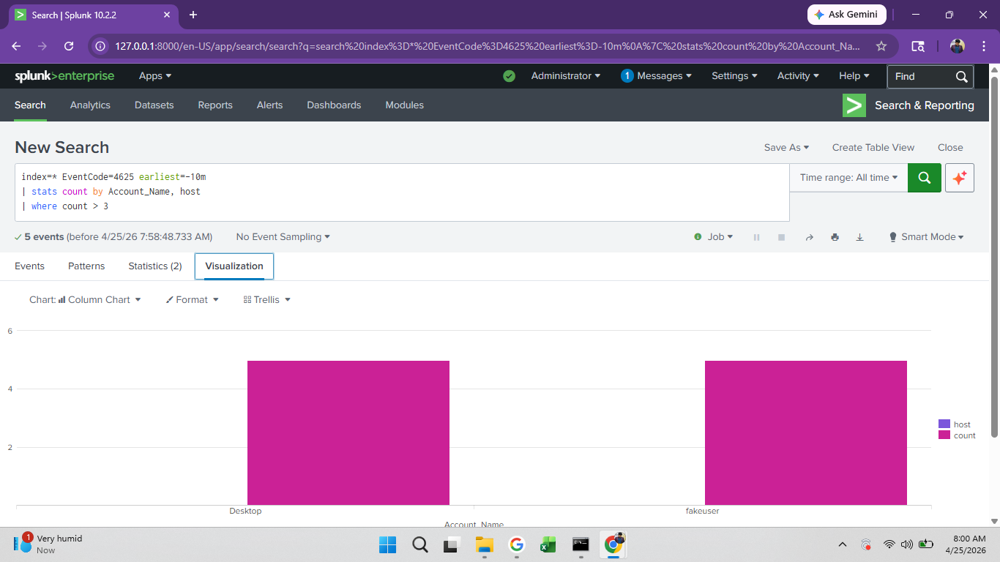
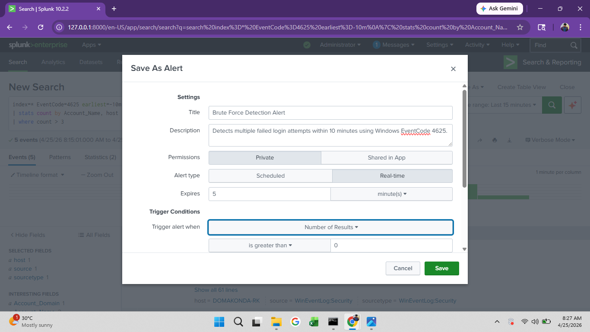
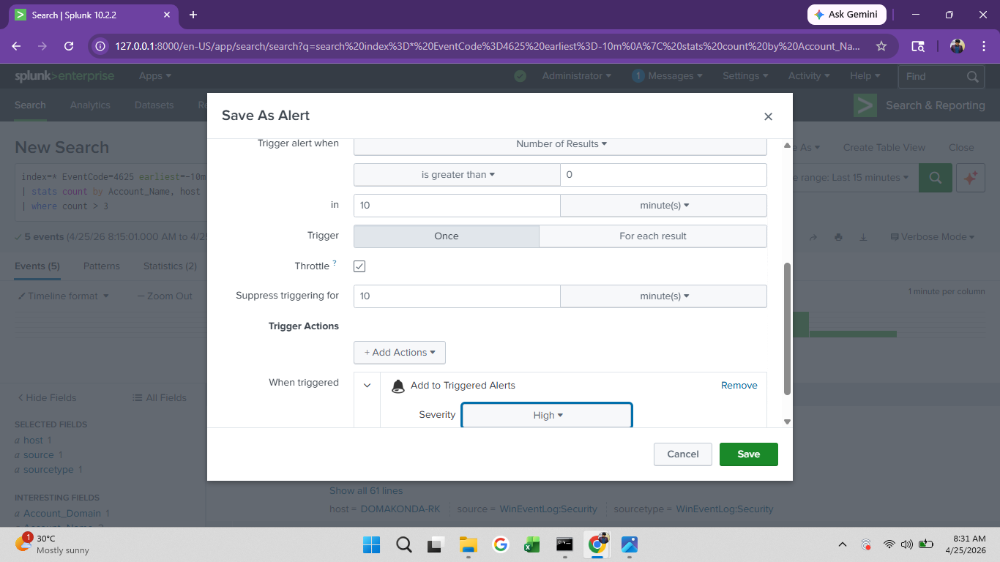
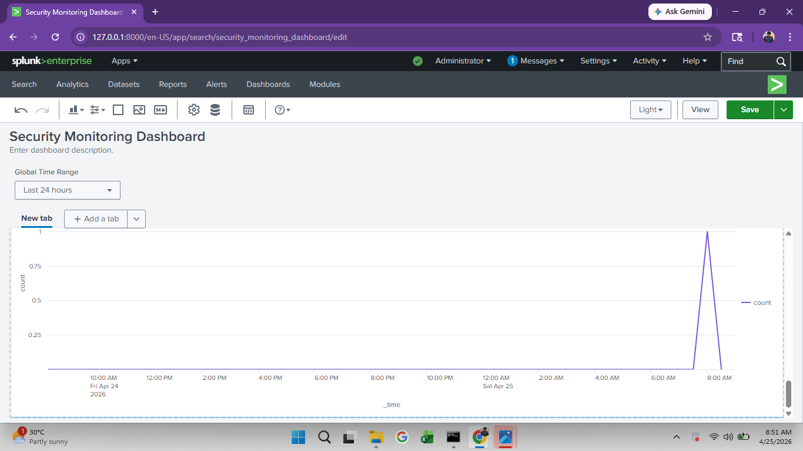

# 🛡️ Windows Security Monitoring & Brute Force Detection using Splunk SIEM

---

## 📌 Project Overview

This project demonstrates how a Security Operations Center (SOC) analyst can use Splunk SIEM to monitor Windows logs, detect suspicious login activity, and identify brute-force attack attempts. The project includes log ingestion, attack simulation, detection logic, alerting, dashboard creation, and incident response.

---

## 🎯 Objective

To design and implement a SIEM-based monitoring system using Splunk to:

- Monitor Windows authentication logs
- Detect failed login attempts
- Identify brute-force attack patterns
- Create alerts and dashboards for real-time monitoring

---

## 🧰 Tools & Technologies

- **Splunk Enterprise** (SIEM)
- **Windows Event Logs** (Security, System, Application)
- **Command Prompt** (Attack Simulation)

---

## 📊 Log Collection

Configured Splunk to ingest the following logs:

- Windows Security Logs
- System Logs
- Application Logs

These logs provide visibility into authentication activity and system behavior.


*Figure 1 — Splunk ingesting Windows Security Logs (host: DOMAKONDA-RK)*

---

## 💣 Attack Simulation

Simulated brute-force login attempts using:

```bat
runas /user:fakeuser cmd
```

Multiple incorrect password attempts were entered to generate failed login events (EventCode 4625).

---

## 🔍 Detection Logic

### 🔴 Step 1 — Failed Login Detection (All Time)

```spl
index=* EventCode=4625
```


*Figure 2 — EventCode 4625 events detected across all time (6 events found)*

---

### ⚡ Step 2 — Real-Time Detection (Last 10 Minutes)

```spl
index=* EventCode=4625 earliest=-10m
```


*Figure 3 — Real-time EventCode 4625 detection within last 10 minutes (5 events)*

---

### 💣 Step 3 — Brute Force Detection (Correlation)

```spl
index=* EventCode=4625 earliest=-10m
| stats count by Account_Name, host
| where count > 3
```


*Figure 4 — Brute Force Correlation: Desktop (5) and fakeuser (5) flagged on DOMAKONDA-RK*


*Figure 5 — Column chart showing brute force count per Account_Name*

---

## 🚨 Alert Configuration

Configured an alert in Splunk with the following settings:

| Setting | Value |
|---|---|
| **Alert Name** | Brute Force Detection Alert |
| **Description** | Detects multiple failed login attempts within 10 minutes using Windows EventCode 4625 |
| **Alert Type** | Real-time |
| **Permissions** | Private |
| **Expires** | 5 minutes |
| **Trigger Condition** | Number of Results is greater than 0 |
| **Time Window** | Last 10 minutes |
| **Trigger Mode** | Once |
| **Throttle** | Enabled — suppress for 10 minutes |
| **Severity** | High |
| **Action** | Add to Triggered Alerts |


*Figure 6 — Save As Alert: Title, Description, Alert Type, Trigger Conditions*


*Figure 7 — Alert: Trigger window (10 min), Throttle enabled, Severity: High*

---

## 📊 Dashboard

Created a Dashboard Studio dashboard with the following panels:

### 📈 Failed Login Trend

```spl
index=* EventCode=4625
| timechart count
```

### 📊 Targeted Users

```spl
index=* EventCode=4625
| stats count by Account_Name
```

### 🔢 Successful Logins

```spl
index=* EventCode=4624
| stats count
```


*Figure 8 — Security Monitoring Dashboard showing failed login spike at ~7:45 AM on Apr 25, 2026*

---

## 🛡️ Incident Response

- Identified repeated failed login attempts within a short time window
- Analyzed affected user accounts: **Desktop** and **fakeuser** on host **DOMAKONDA-RK**
- Correlated timestamps to confirm brute-force pattern (5+ attempts each)
- Recommended:
  - Account lockout policies
  - Multi-factor authentication (MFA)
  - Continuous monitoring with automated alerting
  - Privileged account access review

---

## 📈 Key Findings

- Multiple failed login attempts detected within a short time window
- Accounts **Desktop** and **fakeuser** each triggered **5 failed logins** within 10 minutes
- Activity shows a clear **brute-force attack pattern**
- Alerts triggered successfully based on defined detection logic
- Dashboard panel captured the activity spike in real-time

---

## 💼 Skills Demonstrated

- SIEM (Splunk) log analysis
- Windows Event Log monitoring
- SPL query writing
- Threat detection (Brute Force)
- Alert configuration with throttling and severity classification
- Dashboard creation
- Basic incident response

---

## 📌 Conclusion

This project demonstrates hands-on experience with Splunk SIEM for monitoring Windows logs, detecting brute-force attacks, and implementing real-world SOC workflows including alerting and dashboard-based analysis.
